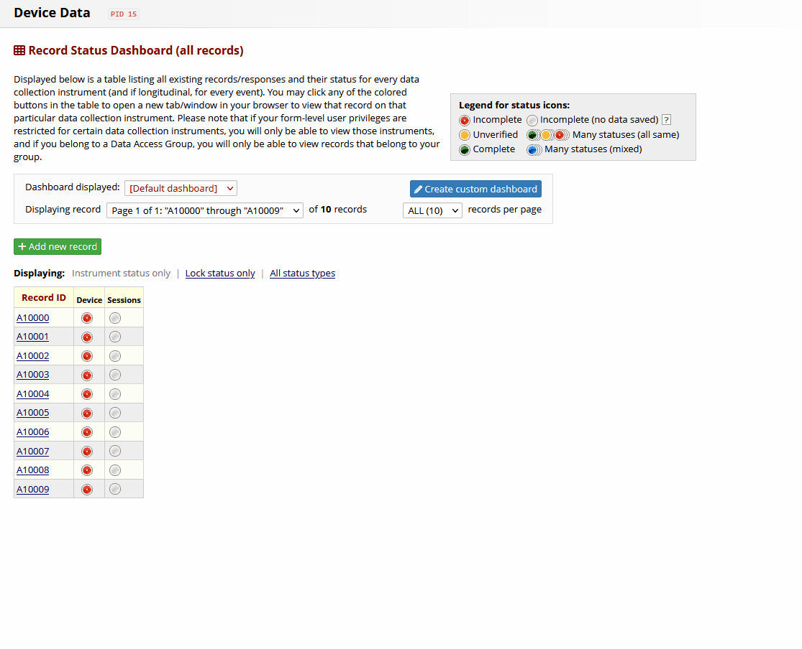

# redcap-device-tracker 
REDCap External Module to cover the case for cross-project multi-device tracking.

## Roadmap

- [x] Support multiple events
- [x] Add configuration check
- [x] Add documentation
- [ ] Add unit tests
- [ ] Add features: 
  - [x] full support for multiple events
  - [x] device deletion
  - [ ] tracking project config check
  - [ ] log management (clear/clean logs)
  - [ ] multi-lang support