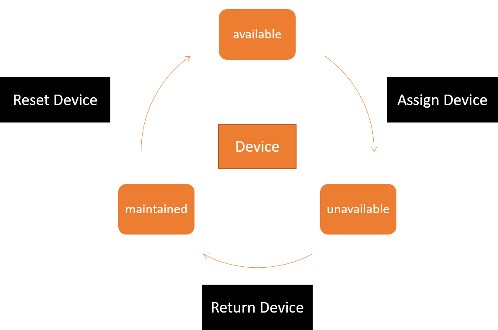

## Documentation
Device Tracker is a REDCap External Module to cover the case for cross-project multi-device tracking.  

Overview:
1. [Introduction](#introduction)
1. [Installation](#installation)
2. [Configuration](#configuration)
3. [Requirements](#requirements)
4. [How to use](#how-to-use)

### Introduction
This module has been developed for a specific use case under specific requirements. Therefore it may be very fitting to your needs or not a solution at all. Please read carefully the below information before deciding to use the module in your project. Customizations and changes in the core idea are not possible.

**Use Case**
A project requires tracking of participants with Tracking Devices.The typical environment parameters are as follows:
- The IDs of participants and devices are pre-defined / known
- There are more participants than tracking devices
- There are multiple tracking device types
- One device can be used for multiple tracking sessions
- Tacking devices need to be maintained between sessions

REDCap does not have a "Device Tracking" feature that keeps a log of a device's "Life Cycles" associated with a participant's tracking history. A "Device Tracking" solution may answer following questions:
- Is a device with ID X of Type Y in the state "available", "unavailable" or "maintained"?
- Which devices are in the state "available", "unavailable" or "maintained"?
- What is the usage history of a device of ID X?
- What are the devices that a participant has used?
..

**Device Life Cycle**
The Device Life Cycle is defined in three stages that are triggered/changed by three events:

1. available
The device is ready to be assigned and not in use.
2. unavailable
The device has been assigned to a particpant and expected to be returned.
3. maintained
The device has been returned by the participant and is now under maintenance to be reset, before it can be reused.

**Event Flow**

### Installation

**Install automatically from REDCap Repo** 
You can download and install the latest version of PDF Injector from [REDCap Repository of External Modules](https://redcap.vanderbilt.edu/consortium/modules/). If you open the Repo link from your REDCap instance, than automatic install will be triggered.

**Install manually from Github Repository** 
You can download the latest release of the module from its [releases page](https://github.com/Research-IT-Swiss-TPH/redcap-device-tracker/releases).

After successfully installing the module you should be able to enable the module through Control Center on system level.

### Configuration
This module is built on the idea of Cross-Projects, that means that it enables data flow between REDCap projects, whereby a single project is used as system-wide data storage for the module's use case.
Therefore, before you can use "Device Tracker Module" you are required to make critical module configurations on system- <u>and</u> project-level.

**System-Level Configuration**
All device data will be saved inside a "Devices Project". More information on the meaning and structure of this project can be found in the requirements section. It is important to configure on system-level the unique "Devices Project" by selecting the according project in the Dropdown Menu.

**Project-Level Configuration**

### Requirements

**Devices Projects**
This project will be used by all other projects as data storage location and therefore should not be changed/edited all to often.
