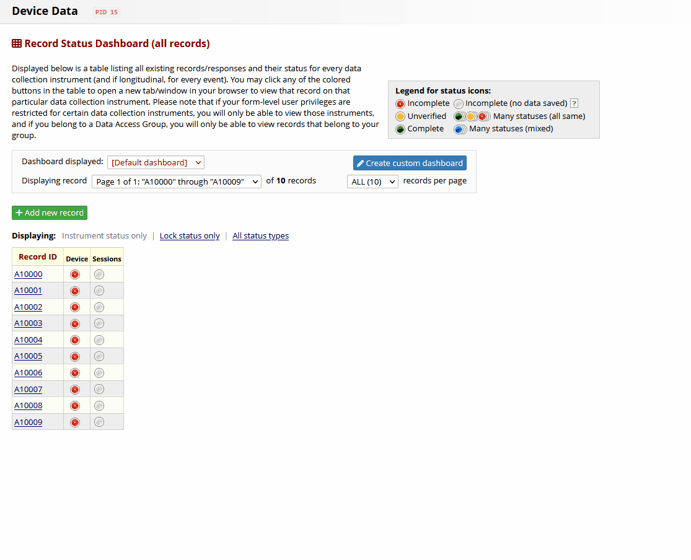

## Documentation
Device Tracker is a REDCap External Module to cover the case for cross-project multi-device tracking.  

Overview:
1. [Introduction](#introduction)
1. [Installation](#installation)
2. [Configuration](#configuration)
3. [Requirements](#requirements)
4. [How to use](#how-to-use)

### Introduction
This module has been developed for a specific use case under specific requirements. Therefore it may be very fitting to your needs or not a solution at all. Please read carefully the below information before deciding to use the module in your project. Customizations and changes in the core idea are not possible.

**Motivation** 
REDCap does not have a "Device Tracking" feature that keeps a log of a device's "Life Cycles" associated with a participant's tracking history. A "Device Tracking" solution may answer following questions:
- Is a device with ID X of Type Y in the state "available", "unavailable" or "maintained"?
- Which devices are in the state "available", "unavailable" or "maintained"?
- What is the usage history of a device of ID X?
- What are the devices that a participant has used?

A project requires tracking of participants with Tracking Devices.The typical environment parameters are as follows:
- The IDs of participants and devices are pre-defined / known
- There are more participants than tracking devices
- There are multiple tracking device types
- One device can be used for multiple tracking sessions
- Tacking devices need to be maintained between sessions

**Module Setup** 
Device Tracker Module acts in between a fixed "Devices Project" and n "Tracking Projects" with m "Trackings". 

- Devices Project:  REDCap project that serves as a system-wide device data storage. For details about project design see requirements.
- Tracking Project: REDCap project that uses Device Tracker interface to track device-participant interactions. A tracking project can implement multiple trackings.
- Tracking: An user interface that is being shown on a REDCap instrument (data entry page) and allows to assign, return or reset devices.

**Device Life Cycle** 
The Device Life Cycle is defined in three stages that are triggered/changed by three events:

1. available: The device is ready to be assigned and not in use.
2. unavailable: The device has been assigned to a particpant and expected to be returned.
3. maintained: The device has been returned by the participant and is now under maintenance to be reset, before it can be reused.

**Event Flow** 

| Event  | Description                                                                                                                                       | Action                                                                                                                                                                                 |
|--------|---------------------------------------------------------------------------------------------------------------------------------------------------|----------------------------------------------------------------------------------------------------------------------------------------------------------------------------------------|
| Assign | Study contributor sends device to participant and assigns this in the tracking project.                                                           | Select a device from a list of available devices from tracking instrument. This automatically sets up a new session for the selected device and changes device state to «unavailable». |
| Return | Participant sends device back to study contributor who documents the returnal in tracking project. The device is then forwarded into maintenance. | Complete session for returned device and enter returnal date. This automatically changes device state to «maintained».                                                                 |
| Reset  | Study contributor receives device from maintenance and resets its state within tracking project.                                                  | Complete maintenance for device. This automatically changes device state back to «available».                                                                                          |

### Installation

**Install automatically from REDCap Repo** 
You can download and install the latest version of PDF Injector from [REDCap Repository of External Modules](https://redcap.vanderbilt.edu/consortium/modules/). If you open the Repo link from your REDCap instance, than automatic install will be triggered.

**Install manually from Github Repository** 
You can download the latest release of the module from its [releases page](https://github.com/Research-IT-Swiss-TPH/redcap-device-tracker/releases).

After successfully installing the module you should be able to enable the module through Control Center on system level.

### Configuration
This module is built on the idea of Cross-Projects, that means that it enables data flow between REDCap projects, whereby a single project is used as system-wide data storage for the module's use case.
Therefore, before you can use "Device Tracker Module" you are required to make critical module configurations on system- <u>and</u> project-level.

**System-Level Configuration** 
The system-level configuration of the Module should only be touched initially and not be changed over time, since it could lead to data loss!
To be sure you have made the correct configuration, you can access the "Configuration Check" page of the Device Tracker Module within Control Center, listed under "External Modules". If any of the required configurations is not green, the module functionality will be blocked system-wide.

System-Level Settings:

- Devices Project: Set a unique data storage destination for all projects that use Device Tracker Module, by selecting the according project in the Dropdown Menu. More information on the meaning and structure of this project can be found in the requirements section.

**Project-Level Configuration** 
The project-level configuration can be made on a per project and per tracking base. This means that you can add multiple trackings per project, instrument and filter by device types or combine additional steps during device events. It is recommended not to change configuration for a tracking, as soon as you have started to track data for one.

Project-Level Settings:

- Trackings: Add as many trackings as you want. Please beware that each tracking you add can effect the page loading time of the instrument, where you are embedding the interface.

- Tracking Field: The field that should be tranfsormed into tracking interface and that stores the tracking ID value.

- Filter by Device Types: Filters the tracking interfaces queries per default by device types. Use comma separated list of select values to define.

- Use device data syncing: Enables/Disables extended data syncing options, so that data from the "Devices Project" and the current Tracking Project's data can be synced. Especially usefull if you would like to access data about the tracking from within the tracking project.

- Use additional fields during 'XXX' action?: Allows the extension of events through additional fields, so that during "assign", "return" and "reset" more fields can/must be filled out by the study worker.

### Requirements

**Devices Project**
This project will be used by all other projects as data storage location and therefore should not be changed/edited all to often. The project design must consist of at least a "device" instrument and a "sessions" instrument (repeating). You can downlaod a project template file for importing in REDCap <a href="/xml/DeviceTrackerModule_Template_DevicesProject.REDCap.xml" download>here</a>.

An overview of the instrument specifications:

### How to use
The typical use case of "Device Tracker" is:

- Import a list of devices to the "Devices Data" project of device type A
- Create a Tracking Project A and configure a new Tracking A that filters by devices of type A
- Open the according tracking instrument and search for a device (or scan the device id) within the tracking interface
- If you find the device assign a tracking to it and continue the whole device life cycle as you need it
- You can follow tracking events through the tracking-, project- or sytem-level log

